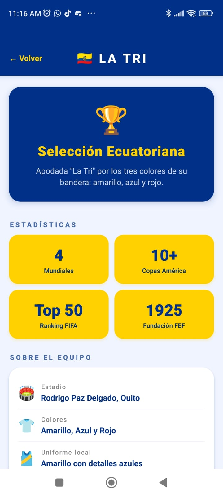
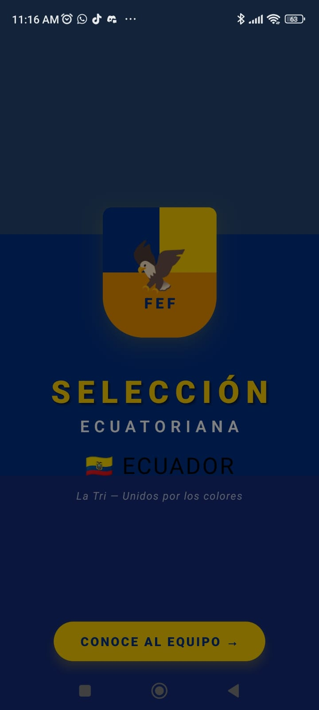

# 🇪🇨 Selección Ecuador App

Aplicación móvil desarrollada con React Native y Expo Go como práctica académica para la asignatura de Dispositivos Móviles.

La aplicación presenta una pantalla de bienvenida (Splash Screen) inspirada en la Selección Ecuatoriana de Fútbol y una pantalla principal con información básica del equipo nacional.

---

## 📱 Características

* Pantalla Splash Screen personalizada.
* Navegación entre pantallas mediante React Navigation.
* Interfaz moderna inspirada en los colores de la bandera ecuatoriana.
* Información general de la Selección Ecuatoriana de Fútbol.
* Listado de jugadores destacados.
* Estadísticas básicas del equipo.
* Compatible con Expo Go para Android e iOS.

---

## 🛠 Tecnologías Utilizadas

* React Native
* Expo SDK 54
* React Navigation
* JavaScript
* Expo Go
* Node.js
* npm

---

## 📂 Estructura del Proyecto

```text
seleccion-ecuador/
│
├── App.js
├── app.json
├── package.json
├── README.md
│
├── assets/
│   └── logo-fef.png
│
└── app/
    ├── SplashScreen.js
    └── HomeScreen.js
```

## 🚀 Instalación

### 1. Clonar el repositorio

```bash
git clone https://github.com/keylet/seleccion-ecuador.git
```

### 2. Ingresar al proyecto

```bash
cd seleccion-ecuador
```

### 3. Instalar dependencias

```bash
npm install
```

### 4. Ejecutar la aplicación

```bash
npx expo start
```

### 5. Abrir en Expo Go

1. Instalar Expo Go en el dispositivo móvil.
2. Ejecutar el proyecto.
3. Escanear el código QR generado.
4. Visualizar la aplicación en el celular.

---

## 🖥 Pantallas

### Splash Screen

La pantalla inicial presenta una bienvenida visual relacionada con la Selección Ecuatoriana de Fútbol. Desde esta pantalla el usuario puede acceder a la información principal de la aplicación.



### Home Screen

Contiene información relevante de la Selección Ecuatoriana:

* Historia básica del equipo.
* Estadísticas generales.
* Información institucional.
* Jugadores destacados.
* Mensaje representativo de apoyo a la selección.



---

## ⚽ Información Mostrada

La aplicación presenta datos relacionados con:

* Nombre del equipo.
* Apodo "La Tri".
* Confederación CONMEBOL.
* Colores representativos.
* Participaciones mundialistas.
* Jugadores destacados.
* Estadísticas generales.

---

## 🎯 Objetivo Académico

El objetivo de este proyecto es aplicar los conocimientos básicos de desarrollo móvil utilizando React Native y Expo, implementando navegación entre pantallas y diseño de interfaces de usuario.

---

## 👨‍💻 Autor

Raúl Pazos

Universidad Central del Ecuador

Carrera de Ingeniería en Sistemas

Período Académico 2026

---

## 🔗 Repositorio

https://github.com/keylet/seleccion-ecuador
